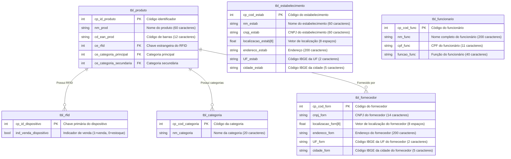

**MATA60 - Banco de Dados**  
Prof. Robespierre Pita  
robespierre.pita@ufba.br

## Trilha Prática

### 1. Modelando a base de dados

#### 1.1. Problema

Alice e Bob são sócios de uma rede de mercearias inteligentes, chamada CompraEsperta. As suas lojas são conteiners adapdatos, climatizados e automatizados que ficam espalhados por condomínios em todas as capitais do país. Cada estabelecimento tem um conjunto produtos que variam entre guloseimas, alimentos prontos (congelados), ingredientes de última hora para receitas comuns, utensílios para o lar, etc. Tudo para prover uma comodidade aos clientes. Não existem funcionários alocados na loja, todos os produtos são marcados com um dispositivo de RFID que, depois de pagos, tem saída liberada do conteiner. O pagamento é feito em terminais de auto-atendimento que são operados pelos próprios clientes. Em seu core-business, modelos de inteligência artificial são responsáveis por definir os melhores locais para estabelecer depósitos que vão armazenar os produtos de reposição das lojas de cada cidade. Esta otimização garante uma diminuição substantiva dos custos, permitindo que a CompraEsperta consiga repôr rapidamente os estoques de cada loja e estabeleça uma proximidade com os fornecedores que ofereçam preços mais competitivos. Os depósitos contam com uma área de armazenamento maior, garantindo que a empresa compre insumos em grande quantidade e negocie os valores com seus fornecedores. No último ano, o número médio de contêiners por capital subiu de 1 para 4.6, tornando proibitivo o controle do estoque através de planilhas. Alice e Bob decidiram então contratar uma empresa de engenharia de software para construir um Sistema de Informação sob medida. Este sistema será responsável por controlar o estoque dos contêiners e depósitos. Quando uma loja atinge o estoque mínimo de um conjunto de produtos, ou quando o depósito está desabastecido, o sistema dispara automaticamente ordens de compra para fornecedores ou de reposição para funcionários da logística. Os principais requisitos do sistema são expostos a seguir.

#### 1.2. Requisitos do Sistema de Informação

- **RF1:** O sistema deve controlar o estoque geral da empresa. Desta forma, a distinção entre depósitos ou lojas deve estar determinada em cada localização de um determinado item/produto.  Ou seja, os produtos em depósito ou lojas são determinados por um atributo de localização.
- **RF2:** O controle do estoque é feito a partir de produtos individuais ou porções. Apesar da compra ser feita por lotes e caixas, o sistema deve considerar apenas unidades em seus registros e relatórios.
- **RF3:** Cada produto individual está associado a uma tag RFID. O status desta tag determinará se um produto ainda está disponível em estoque ou não.
- **RF4:** O sistema deve ser capaz de controlar os fornecedores de cada produto. Multiplas empresas podem fornecer um ou mais items. Fornecedores cuja a data de ultima compra seja maior de 180 dias deve ser considerada inativa.
- **RF5:** O sistema deve ser capaz de prover relatórios que informem: **i)** o nível de estoque para cada categoria de produtos em cada loja ou depósito; **ii)** os fornecedores mais frequentes, com menores custos para cada categoria de produtos; **iii)** as lojas com maior vazão de produtos num período; **iv)** produtos com maior proximidade de vencimento; etc.
- **RF6:** a categoria de produtos tem estoque mínimo e maximo associado. Estes números são distintos para lojas e depósitos.

Novos requisitos podem surgir no decorrer do desenvolvimento do sistema.

#### 1.3. Delimitação do mini-mundo para o banco de dados

O banco de dados relacional para suportar as operações deste sistema de informação deve contar
com as seguintes entidades e atributos:

- **tbl_produto:** tabela que concentra informações sobre os itens individuais que compõem o acervo/estoque da empresa.
  - `cp_id_produto [int, incremental]`: código identificador do produto individal. Único e incremental.
  - `nm_prod [str, 60 caracteres]`: nome do produto, conforme normas técnicas para integração em notas fiscais (Norma Técnica 2021.004 – v.133).
  - `cd_ean_prod [str, 12 caracteres]`: código de barras do produto, conforme padrão EAN.
  - `ce_rfid [int, 8 bytes]`: chave estrangeira que define o rfid do produto.
  - `ce_categoria_principal [int, 8 bytes]`: chave estrangeira que define a categoria principal do produto.
  - `ce_categoria_secundaria [int, 8 bytes]`: chave estrangeira que define a categoria secundária do produto.

- **tbl_rfid:** taela que concentra informações sobre os dispositivos de identificação individual dos produtos.
  - `cp_id_dispositivo [int, 8 bytes]`: chave primária que identifica dispositivo.
  - `ind_venda_dispositivo [bool, 1 byte]`: flag que indica se produto já foi vendido (1 = vendido, 0 = em estoque).

- **tbl_categoria:** tabela que concentra informações sobre as categorias de cada produto.
  - `cp_cod_categoria [int, 4 bytes]`: chave primária que identifica a categoria de cada produto.
  - `nm_categoria [str, 20 caracteres]`: nome da categoria.

- **tbl_estabelecimento:** tabela que concentra informações dos estabelecimentos (lojas e depósitos)
  - `cp_cod_estab [int, 8 bytes]`: chave primária que identifica o estabelecimento.
  - `nm_estab [str, 60 caracteres]`: nome do estabelecimento.
  - `cnpj_estab [str, 60 caracteres]`: CNPJ do estebelecimento, em caso de filial ou empresa parceira.
  - `localizacao_estab [float vector, 8 espaços]`: vetor com latitude e longitude dos 4 pontos que delimitam o espaço do estabelecimento no espaço geográfico.
  - `endereco_estab [str, 200 caracteres]`: endereço do estabelecimento.
  - `UF_estab [str, 2 caracteres]`: código IBGE da UF do establecimento.
  - `cidade_estab [str, 5 caracteres]`: código IBGE da cidade do establecimento.

- **tbl_funcionario:** tabela que concentra informações sobre os funcionários responsáveis pela reposição do estoque nas lojas e depósitos.
  - `cp_cod_func [int, 8 bytes]`: chave primária que identifica o funcionário.
  - `nm_func [str, 200 caracteres]`: nome completo do funcionário.
  - `cpf_func [str, 11 caracteres]`: CPF do funcionário.
  - `funcao_func [str, 40 caracteres]`: função do funcionário.

- **tbl_fornecedor:** tabela que concentra informações sobre os fornecedores dos produtos individuais.
  - `cp_cod_forn [int, 8 bytes]`: chave primária que identifica o fornecedor.
  - `cnpj_forn [str, 14 bytes]`: CNPJ do fornecedor.
  - `localizacao_forn [float vector, 8 espaços]`: vetor com latitude e longitude dos 4 pontos que delimitam o espaço do fornecedor no espaço geográfico.
  - `endereco_forn [str, 200 caracteres]`: endereço fornecedor.
  - `UF_forn [str, 2 caracteres]`: código IBGE da UF do fornecedor.
  - `cidade_forn [str, 5 caracteres]`: código IBGE da cidade do fornecedor.

As relações entre estas entidades deve seguir as regras a seguir:

#### Regras de relacionamento

- Um fornecedor pode fornecer nenhum ou vários produtos. Produtos podem ser fornecidos por mais de um fornecedor. As relações entre fornecedores e produtos deve gerar informações sobre o preço de venda, data de venda e data de vencimento.
- Um produto só pode ser identificado por um único RFID. RFID são consumidos por apenas um produto.
- Uma mesma categoria pode rotular mais de um produto. Um produto pode ter apenas uma categoria principal e outra secundária.
- Um estabelecimento vende ou distribui vários produtos e um mesmo produto pode ser oferecido por vários estabelecimentos. As relações entre estabelecimentos e produtos deve gerar informações sobre itens comprados, preços e data de venda e outros atributos pertinentes.

### Modelagem Inicial

### Trilha prática 1

Com base na descrição do Sistema de Informação:
1. Sugira novas tabelas, variáveis, relacionamentos ou requisitos.
2. Use o BrModelo para criar os modelos conceitual e lógico do banco de dados.
3. Crie o SQL DDL do banco modelado.
4. Popule as tabelas com pelo menos 200 registros.

#### Elaboração

Abaixo segue a descrição e motivação da Tabela e sua formação inicial:

---
Como cada ordem de compra de um produto por fornecedor devem conter informações adicionais e é uma relação de **P x F**, deve existir uma tabela auxiliar para persistir essas relações e seus dados auxiliares.

- **tbl_ordem_compra:** tabela que concentra informações sobre as ordens de compra, relacionando produtos e fornecedores, bem como os detalhes da transação.
  - `cp_id_ordem [int, incremental]`: código identificador da ordem de compra. Único e incremental.
  - `ce_produto [int, 8 bytes]`: chave estrangeira que define o produto relacionado à ordem de compra. Refere-se ao `cp_id_produto` da **tbl_produto**.
  - `ce_fornecedor [int, 8 bytes]`: chave estrangeira que define o fornecedor relacionado à ordem de compra. Refere-se ao `cp_cod_forn` da **tbl_fornecedor**.
  - `dt_venda [date]`: data da venda do produto, indicando quando a transação foi realizada.
  - `dt_vencimento [date]`: data de vencimento do pagamento da ordem de compra.
  - `preco_por_quantidade [float, 10,2]`: preço total considerando a quantidade de produtos comprados, com até duas casas decimais.
  - `quantidade [int, 8 bytes]`: quantidade de produtos comprados nesta ordem de compra.

---

Como o sistema deve ter informações individuais por produto, então vale a criação de uma distinção de uma classe de itens ( produtos ) e os itens ( um elemento do grupo de produtos ). Além disso, deverá tratar as transferências dos itens de forma rastreável. Segue as adaptações e adições necessárias: 

- **tbl_produto:** tabela que concentra informações gerais sobre os produtos que compõem o acervo da empresa. Cada produto pode ter múltiplos itens específicos (unidades individuais).
  - `cp_id_produto [int, incremental]`: código identificador do produto. Único e incremental.
  - `nm_prod [str, 60 caracteres]`: nome do produto, conforme normas técnicas para integração em notas fiscais (Norma Técnica 2021.004 – v.133).
  - `cd_ean_prod [str, 12 caracteres]`: código de barras do produto, conforme padrão EAN.
  - `ce_categoria_principal [int, 8 bytes]`: chave estrangeira que define a categoria principal do produto.
  - `ce_categoria_secundaria [int, 8 bytes]`: chave estrangeira que define a categoria secundária do produto.

- **tbl_item:** tabela que concentra informações sobre os itens individuais relacionados aos produtos (unidades individuais no estoque). Cada item pertence a um produto da tabela **tbl_produto**.
  - `cp_id_item [int, incremental]`: código identificador do item individual. Único e incremental.
  - `ce_produto [int, 8 bytes]`: chave estrangeira que define o produto ao qual o item pertence. Refere-se ao `cp_id_produto` da **tbl_produto**.
  - `ce_rfid [int, 8 bytes]`: chave estrangeira que define o rfid do item. Refere-se ao `cp_id_dispositivo` da **tbl_rfid**.
  - `ce_lote_venda [int, 8 bytes]`: chave estrangeira que define o lote de venda ao qual o item pertence. Refere-se ao `cp_id_ordem` da **tbl_ordem_compra**.
  - `ce_ultima_transacao [int, 8 bytes]`: chave estrangeira que define a última transação feita para o item. Refere-se ao `cp_id_transacao` da **tbl_transacao**.

- **tbl_transacao:** tabela que concentra informações sobre as transações realizadas para os itens individuais. Isso inclui compras, transferências e vendas.
  - `cp_id_transacao [int, incremental]`: código identificador da transação. Único e incremental.
  - `ce_item [int, 8 bytes]`: chave estrangeira que define o item envolvido na transação. Refere-se ao `cp_id_item` da **tbl_item**.
  - `dt_transacao [date]`: data em que a transação foi realizada.
  - `tp_transacao [string, 20 caracteres]`: tipo da transação, podendo ser "compra", "transferencia" ou "venda".
  - `ce_estab_origem [int, 8 bytes]`: chave estrangeira que define o estabelecimento de origem da transação. Refere-se ao `cp_cod_estab` da **tbl_estabelecimento**. Pode ser nulo (por exemplo, em uma compra).
  - `ce_estab_destino [int, 8 bytes]`: chave estrangeira que define o estabelecimento de destino da transação. Refere-se ao `cp_cod_estab` da **tbl_estabelecimento**. Pode ser nulo (por exemplo, em uma venda).

---

Para tornar o controle do estoque mais preciso, cabe a adequação de um requisito. No qual, o controle de estoque pelo estabelecimento será dado por produto ao invés de por cateoria. Segue abaixo a nova tabela:

- **tbl_estoque:** tabela que concentra informações sobre o controle de estoque de cada produto em cada estabelecimento, com limites mínimos e máximos de quantidade.
  - `cp_id_estoque [int, incremental]`: código identificador do controle de estoque. Único e incremental.
  - `ce_produto [int, 8 bytes]`: chave estrangeira que define o produto cujo estoque está sendo controlado. Refere-se ao `cp_id_produto` da **tbl_produto**.
  - `ce_estabelecimento [int, 8 bytes]`: chave estrangeira que define o estabelecimento ao qual o estoque pertence. Refere-se ao `cp_cod_estab` da **tbl_estabelecimento**.
  - `qtd_min_estoque [int, 8 bytes]`: quantidade mínima de estoque que deve ser mantida no estabelecimento para o produto.
  - `qtd_max_estoque [int, 8 bytes]`: quantidade máxima de estoque permitida no estabelecimento para o produto.

