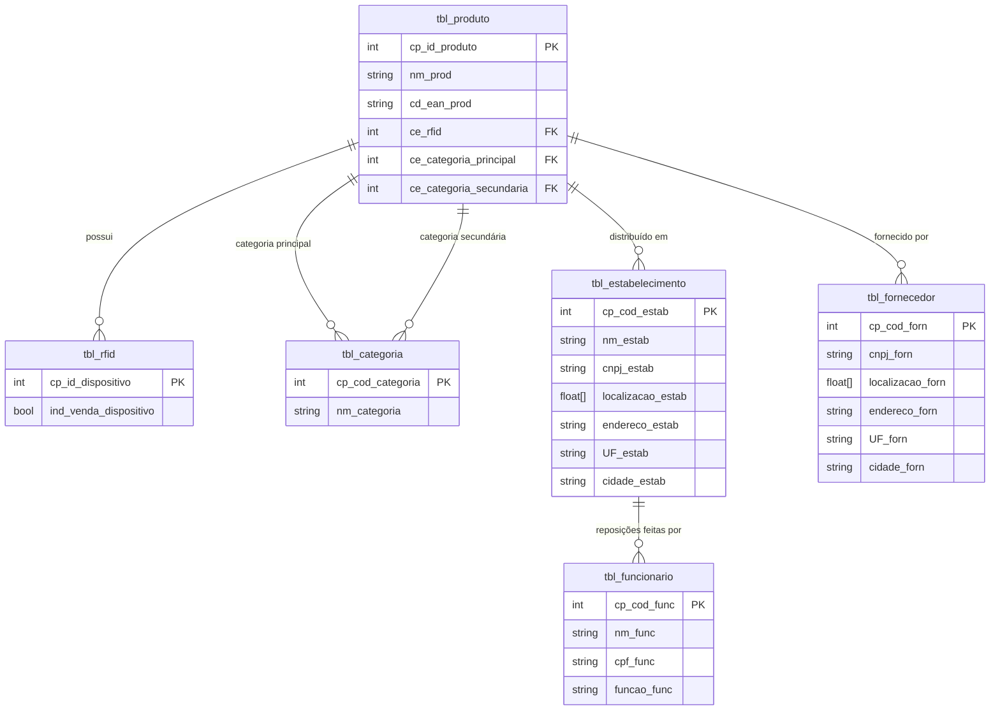

**MATA60 - Banco de Dados**  
Prof. Robespierre Pita  
robespierre.pita@ufba.br

## Trilha Prática

### 1. Modelando a base de dados

#### 1.1. Problema

Alice e Bob são sócios de uma rede de mercearias inteligentes, chamada CompraEsperta. As suas lojas são contêineres adaptados, climatizados e automatizados, espalhados por condomínios em todas as capitais do país. Cada estabelecimento tem um conjunto de produtos que variam entre guloseimas, alimentos prontos (congelados), ingredientes de última hora, utensílios para o lar, etc. Não existem funcionários alocados na loja. Todos os produtos são marcados com um dispositivo de RFID que, depois de pagos, têm sua saída liberada do contêiner. O pagamento é feito em terminais de autoatendimento, operados pelos próprios clientes.

Modelos de inteligência artificial são responsáveis por definir os melhores locais para estabelecer depósitos que armazenam produtos para reposição nas lojas de cada cidade. Isso garante uma otimização nos custos e proximidade com fornecedores que oferecem melhores preços. Recentemente, o número médio de contêineres por capital aumentou, tornando proibitivo o controle do estoque através de planilhas. Alice e Bob decidiram então contratar uma empresa de software para construir um Sistema de Informação que controle o estoque dos contêineres e depósitos.

#### 1.2. Requisitos do Sistema de Informação

- **RF1:** O sistema deve controlar o estoque geral da empresa, diferenciando depósitos de lojas, através de um atributo de localização.
- **RF2:** O controle do estoque é feito por produtos individuais ou porções. As compras são feitas por lotes, mas o sistema deve registrar apenas unidades.
- **RF3:** Cada produto individual está associado a uma tag RFID, cujo status indica se está disponível em estoque ou não.
- **RF4:** O sistema deve controlar os fornecedores. Múltiplas empresas podem fornecer itens, mas fornecedores inativos (última compra há mais de 180 dias) devem ser sinalizados.
- **RF5:** O sistema deve prover relatórios que informem níveis de estoque, fornecedores frequentes, lojas com maior vazão, produtos próximos do vencimento, etc.
- **RF6:** Cada categoria de produtos possui um estoque mínimo e máximo. Estes valores variam entre lojas e depósitos.

Novos requisitos podem surgir no decorrer do desenvolvimento do sistema.

#### 1.3. Delimitação do mini-mundo para o banco de dados

O banco de dados relacional deve contar com as seguintes entidades e atributos:

- **tbl_produto:**
  - `cp_id_produto [int, incremental]`: código identificador único do produto.
  - `nm_prod [str, 60 caracteres]`: nome do produto conforme normas fiscais.
  - `cd_ean_prod [str, 12 caracteres]`: código de barras EAN.
  - `ce_rfid [int, 8 bytes]`: chave estrangeira para o RFID do produto.
  - `ce_categoria_principal [int, 8 bytes]`: chave estrangeira para a categoria principal.
  - `ce_categoria_secundaria [int, 8 bytes]`: chave estrangeira para a categoria secundária.

- **tbl_rfid:**
  - `cp_id_dispositivo [int, 8 bytes]`: chave primária que identifica o dispositivo.
  - `ind_venda_dispositivo [bool, 1 byte]`: flag que indica se o produto já foi vendido (1 = vendido, 0 = em estoque).

- **tbl_categoria:**
  - `cp_cod_categoria [int, 4 bytes]`: chave primária da categoria.
  - `nm_categoria [str, 20 caracteres]`: nome da categoria.

- **tbl_estabelecimento:**
  - `cp_cod_estab [int, 8 bytes]`: chave primária do estabelecimento.
  - `nm_estab [str, 60 caracteres]`: nome do estabelecimento.
  - `cnpj_estab [str, 60 caracteres]`: CNPJ.
  - `localizacao_estab [float vector, 8 espaços]`: latitude e longitude que delimitam o estabelecimento.
  - `endereco_estab [str, 200 caracteres]`: endereço do estabelecimento.
  - `UF_estab [str, 2 caracteres]`: código IBGE da UF.
  - `cidade_estab [str, 5 caracteres]`: código IBGE da cidade.

- **tbl_funcionario:**
  - `cp_cod_func [int, 8 bytes]`: chave primária do funcionário.
  - `nm_func [str, 200 caracteres]`: nome completo.
  - `cpf_func [str, 11 caracteres]`: CPF.
  - `funcao_func [str, 40 caracteres]`: função do funcionário.

- **tbl_fornecedor:**
  - `cp_cod_forn [int, 8 bytes]`: chave primária do fornecedor.
  - `cnpj_forn [str, 14 bytes]`: CNPJ do fornecedor.
  - `localizacao_forn [float vector, 8 espaços]`: latitude e longitude.
  - `endereco_forn [str, 200 caracteres]`: endereço.
  - `UF_forn [str, 2 caracteres]`: código IBGE da UF.
  - `cidade_forn [str, 5 caracteres]`: código IBGE da cidade.

#### Regras de relacionamento

- Um fornecedor pode fornecer nenhum ou vários produtos. Produtos podem ser fornecidos por mais de um fornecedor.
- Um produto é identificado por um único RFID, e RFID é exclusivo de um produto.
- Um produto pode ter uma categoria principal e outra secundária.
- Um estabelecimento vende vários produtos, e um produto pode ser oferecido por vários estabelecimentos.

### Trilha prática 1

Com base na descrição do Sistema de Informação:
1. Sugira novas tabelas, variáveis, relacionamentos ou requisitos.
2. Use o BrModelo para criar os modelos conceitual e lógico do banco de dados.
3. Crie o SQL DDL do banco modelado.
4. Popule as tabelas com pelo menos 200 registros.

### Trilha prática 2

Com base nos requisitos:
1. Produza 20 queries básicas, 15 intermediárias e 10 avançadas.
2. Execute 50 vezes essas queries, registrando o tempo de execução.
3. Elabore um plano de indexação, execute as queries novamente e registre o speedup.
4. Elabore um plano de tuning, execute as queries novamente e registre o speedup.

### Trilha prática 3

Com base nos requisitos:
1. Crie duas views.
2. Crie duas stored procedures.
3. Crie duas transações.

## Implementação

1- Diagrama Inicial do Requisito:

